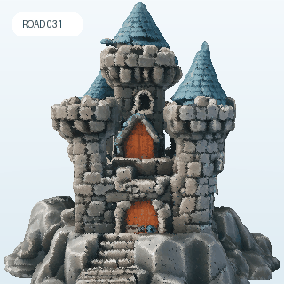

# ROAD: Reciprocal-Objective Alignment of Discriminative Semantics for 3D Shape Generation

<p align="center">
  <a href="https://github.com/LuoMayao">Xiao Luo</a><sup>1</sup> &nbsp;&nbsp;
  Mingyang Du<sup>1</sup> &nbsp;&nbsp;
  <a href="https://github.com/LMD0311">Xin Zhou</a><sup>1</sup> &nbsp;&nbsp;
  <a href="https://github.com/jerryfeng2003">Tianrui Feng</a><sup>1</sup><br>
  Xiwu Chen<sup>2</sup> &nbsp;&nbsp;
  Xiaofan Li<sup>3</sup> &nbsp;&nbsp;
  <a href="https://github.com/zhangzjn">Jiangning Zhang</a><sup>3</sup> &nbsp;&nbsp;
  <a href="https://github.com/dk-liang">Dingkang Liang</a><sup>1,*</sup>
</p>

<p align="center">
  <sup>1</sup>Huazhong University of Science and Technology, China<br>
  <sup>2</sup>Megvii, China &nbsp;&nbsp;
  <sup>3</sup>Zhejiang University, China<br>
  <code>{dkliang, tianruifeng, xzhou03}@hust.edu.cn</code><br>
  <sup>*</sup>Corresponding author
</p>

<p align="center">
  <a href="https://arxiv.org/abs/2607.28581"></a>
  &nbsp;&nbsp;
  <a href="https://h-embodvis.github.io/ROAD/"></a>
  &nbsp;&nbsp;
  <a href="https://huggingface.co/H-EmbodVis/ROAD"></a>
</p>

<p align="center">
  <a href="assets/000.pdf">
    
  </a>
</p>

ROAD transfers discriminative 3D semantics into shape generation through
global feature alignment and token-level matching. This release contains the
code and configurations for:

- `configs/baseline.yaml`: Step1X-3D rectified-flow baseline.
- `configs/uni3d_repa.yaml`: ROAD with a frozen Uni3D teacher, global REPA
  alignment, and token-level Hungarian matching.

Model weights and full training datasets are not included.

## 3D Results

The following textured GLBs are rendered as 360-degree turntables.

<table>
  <tr>
    <td align="center">
      <br>
      <sub>001 · Bread man</sub>
    </td>
    <td align="center">
      <br>
      <sub>002 · Cat</sub>
    </td>
    <td align="center">
      <br>
      <sub>003 · Food bowl</sub>
    </td>
  </tr>
  <tr>
    <td align="center">
      <br>
      <sub>004 · Fire hydrant</sub>
    </td>
    <td align="center">
      <br>
      <sub>005 · Aircraft</sub>
    </td>
    <td align="center">
      <br>
      <sub>006 · Castle</sub>
    </td>
  </tr>
</table>

## Installation

Run all commands from the repository root.

### Training

The training setup uses Python 3.10, PyTorch 2.5.1, and CUDA 11.8.

```bash
conda env create -f environment.yml
conda activate step1x
pip install -r requirements.txt
pip install flash-attn==2.8.3 --no-build-isolation
```

### Evaluation

Use the existing evaluation environment:

```bash
conda activate driveuni3d
```

Alternatively, add the evaluation packages to `step1x`:

```bash
conda activate step1x
pip install -r requirements-eval.txt
```

Training uses its own Uni3D subset under `training/uni3d/`; Uni3D-I uses the
separate inference subset under `evaluation/uni3d/`. Both select point groups
with farthest-point sampling.

## Pretrained Weights

Prepare the following files:

```text
pretrained/
├── vae/
│   └── diffusion_pytorch_model.safetensors
├── visual_encoder/
│   ├── config.json
│   ├── model.safetensors
│   └── preprocessor_config.json
├── uni3d/
│   └── model.pt
└── evaluation/
    ├── uni3d_openclip.bin
    ├── ulip_openclip.bin
    └── ulip2_pointbert.pt
```

The baseline uses the Step1X-3D VAE and DINOv2 visual encoder. ROAD training
and Uni3D-I additionally use `pretrained/uni3d/model.pt`. The remaining
evaluation checkpoints are used by Uni3D-I and ULIP-I. See
[`pretrained/README.md`](pretrained/README.md) for details.

## Data

### Training Data

```text
data/3d_data/
├── train.json
├── val.json
├── test.json
├── surfaces/
│   └── <uid>.npz
└── 3d_images/
    └── <uid>/
        ├── 012.png
        ├── 013.png
        └── ...
```

Each split is a JSON list of UIDs. Each NPZ file contains `surface` and
`sharp_surface`, both stored as `N x 6` XYZ-and-normal arrays. Views 12–23 are
used during training. A small synthetic dataset for checking the complete
pipeline is included at `data/demo_3d_data`.

For details on mesh preprocessing and dataset preparation, please refer to the
data preprocessing pipeline provided by
[Step1X-3D](https://github.com/stepfun-ai/Step1X-3D).

Use another dataset root with an OmegaConf override:

```bash
GPU_IDS=0 bash scripts/train_baseline.sh data.root_dir=/path/to/3d_data
```

### Evaluation Data

```text
evaluation_data/
├── manifest.json
├── images/
│   └── <uid>/eval.png
└── meshes/
    └── <uid>/eval.glb
```

`manifest.json` is a JSON list of UIDs shared by the image and mesh roots.
Nested UIDs such as `category/example` are supported.

## Training

### Baseline

```bash
# Single GPU
GPU_IDS=0 bash scripts/train_baseline.sh

# Multiple GPUs on one node
GPU_IDS=0,1,2,3 bash scripts/train_baseline.sh
```

### ROAD / Uni3D-REPA

```bash
# Single GPU
GPU_IDS=0 bash scripts/train_uni3d_repa.sh

# Multiple GPUs on one node
GPU_IDS=0,1,2,3 bash scripts/train_uni3d_repa.sh
```

The default ROAD configuration uses 10,000 alignment points, global alignment
weight 0.5, token-matching weight 0.1, and starts token matching at epoch 3.
The frozen teacher is configured by `configs/uni3d_g.json`. To use the SciPy
matcher, append `system.matcher=cpu`.

All OmegaConf options can be appended to the launcher:

```bash
GPU_IDS=0,1 bash scripts/train_uni3d_repa.sh \
  data.batch_size=4 \
  data.num_workers=4 \
  trainer.max_epochs=10
```

Resume from a Lightning or DeepSpeed checkpoint with:

```bash
GPU_IDS=0,1 bash scripts/train_uni3d_repa.sh resume=/path/to/last.ckpt
```

## Evaluation

Run Uni3D-I and ULIP-I on two GPUs:

```bash
conda activate driveuni3d

GPU_IDS=0,1 bash scripts/evaluate.sh \
  evaluation_data/manifest.json \
  evaluation_data/images \
  evaluation_data/meshes \
  outputs/evaluation
```

The command writes:

```text
outputs/evaluation/
├── uni3d_i.json
└── ulip_i.json
```

Run only Uni3D-I on one GPU:

```bash
CUDA_VISIBLE_DEVICES=0 python -m evaluation.evaluate_uni3d \
  --manifest evaluation_data/manifest.json \
  --image-root evaluation_data/images \
  --glb-root evaluation_data/meshes \
  --openclip-checkpoint pretrained/evaluation/uni3d_openclip.bin \
  --output outputs/evaluation/uni3d_i.json
```

Run only ULIP-I on one GPU:

```bash
CUDA_VISIBLE_DEVICES=0 python -m evaluation.evaluate_ulip \
  --manifest evaluation_data/manifest.json \
  --image-root evaluation_data/images \
  --glb-root evaluation_data/meshes \
  --openclip-checkpoint pretrained/evaluation/ulip_openclip.bin \
  --ulip-checkpoint pretrained/evaluation/ulip2_pointbert.pt \
  --output outputs/evaluation/ulip_i.json
```

## Outputs

Training checkpoints and logs are written below `exp_root_dir`. Inspect
TensorBoard logs with:

```bash
tensorboard --logdir outputs
```

## License and Attribution

The Step1X-3D-derived training code is distributed under Apache License 2.0.
The reduced Uni3D subsets under `training/uni3d/` and `evaluation/uni3d/`
retain the upstream MIT license. The reduced ULIP evaluation code retains the
upstream BSD 3-Clause license.

See `LICENSE`, `NOTICE`, `MODIFICATIONS.md`, `training/uni3d/LICENSE`,
`evaluation/uni3d/LICENSE`, and `evaluation/LICENSE-ULIP`. Model weights and
external datasets are distributed separately under their respective terms.

## Acknowledgement

This project builds upon
[Step1X-3D](https://github.com/stepfun-ai/Step1X-3D),
[Uni3D](https://github.com/baaivision/Uni3D), and
[ULIP](https://github.com/salesforce/ULIP).
We thank the authors of these projects for their contributions to the
open-source community.

## Citation

If you find this repository useful for your research, please consider citing
our paper:

```bibtex
@misc{luo2026roadreciprocalobjectivealignmentdiscriminative,
  title         = {ROAD: Reciprocal-Objective Alignment of Discriminative Semantics for 3D Shape Generation},
  author        = {Xiao Luo and Mingyang Du and Xin Zhou and Tianrui Feng and Xiwu Chen and Xiaofan Li and Jiangning Zhang and Dingkang Liang},
  year          = {2026},
  eprint        = {2607.28581},
  archivePrefix = {arXiv},
  primaryClass  = {cs.CV},
  url           = {https://arxiv.org/abs/2607.28581}
}
```