# Model showcase

This directory contains the selected qualitative examples released with the
project. Examples are numbered `001` through `034` in selection order. Each
numbered directory contains the original conditioning image, the textured GLB,
all selected high-resolution renders, and two lightweight gallery thumbnails.

Machine-readable paths are listed in [`manifest.json`](manifest.json).

Unless noted otherwise, these showcase assets are distributed under the
repository's Apache License 2.0.

| ID | Condition | Generated geometry | Download |
|---:|---|---|---|
| 001 |  | <a href="001/renders/ISO_Normal.png">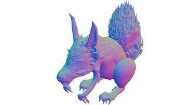</a> | [model.glb](001/model.glb) |
| 002 |  |  | [model.glb](002/model.glb) |
| 003 |  | <a href="003/renders/Hero_Normal.png">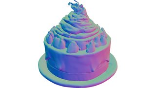</a> | [model.glb](003/model.glb) |
| 004 |  | <a href="004/renders/Hero_Normal.png">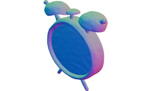</a> | [model.glb](004/model.glb) |
| 005 |  |  | [model.glb](005/model.glb) |
| 006 |  | <a href="006/renders/ISO_Normal.png">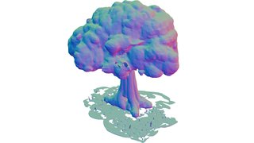</a> | [model.glb](006/model.glb) |
| 007 |  | <a href="007/renders/ISO_Normal.png">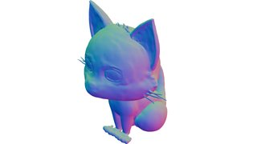</a> | [model.glb](007/model.glb) |
| 008 | <a href="008/condition.png">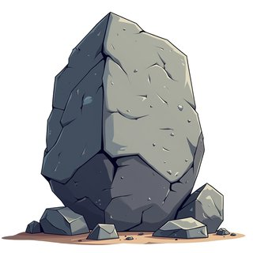</a> | <a href="008/renders/ISO_Normal.png">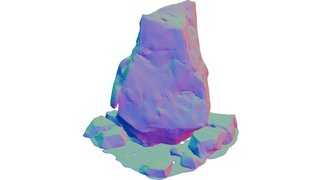</a> | [model.glb](008/model.glb) |
| 009 |  | <a href="009/renders/ISO_Normal.png">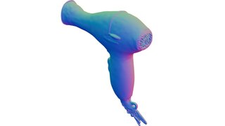</a> | [model.glb](009/model.glb) |
| 010 |  |  | [model.glb](010/model.glb) |
| 011 | <a href="011/condition.png">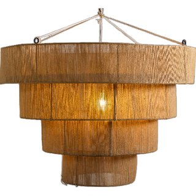</a> | <a href="011/renders/ISO_Normal.png">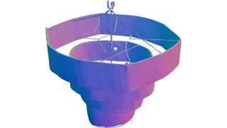</a> | [model.glb](011/model.glb) |
| 012 |  |  | [model.glb](012/model.glb) |
| 013 |  | <a href="013/renders/ISO_Normal.png">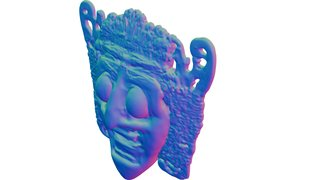</a> | [model.glb](013/model.glb) |
| 014 |  | <a href="014/renders/ISO_Normal.png">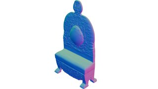</a> | [model.glb](014/model.glb) |
| 015 |  |  | [model.glb](015/model.glb) |
| 016 |  | <a href="016/renders/ISO_Normal.png">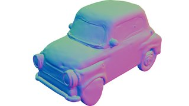</a> | [model.glb](016/model.glb) |
| 017 |  | <a href="017/renders/ISO_Normal.png">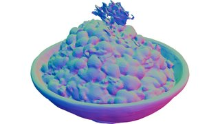</a> | [model.glb](017/model.glb) |
| 018 |  | <a href="018/renders/ISO_Normal.png">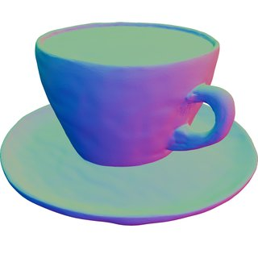</a> | [model.glb](018/model.glb) |
| 019 | <a href="019/condition.png">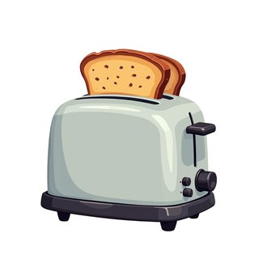</a> | <a href="019/renders/ISO_Normal.png">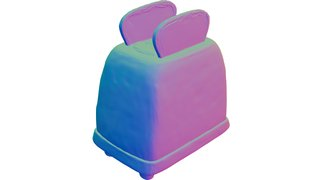</a> | [model.glb](019/model.glb) |
| 020 | <a href="020/condition.png">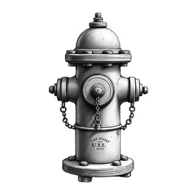</a> |  | [model.glb](020/model.glb) |
| 021 |  | <a href="021/renders/ISO_Normal.png">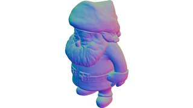</a> | [model.glb](021/model.glb) |
| 022 | <a href="022/condition.png">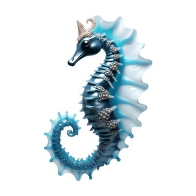</a> | <a href="022/renders/ISO_Normal.png">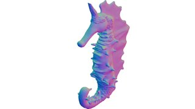</a> | [model.glb](022/model.glb) |
| 023 |  | <a href="023/renders/ISO_Normal.png">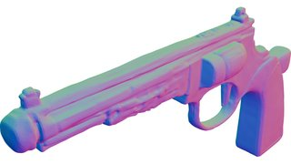</a> | [model.glb](023/model.glb) |
| 024 |  | <a href="024/renders/ISO_Normal.png">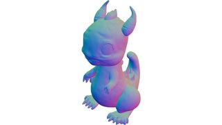</a> | [model.glb](024/model.glb) |
| 025 | <a href="025/condition.png">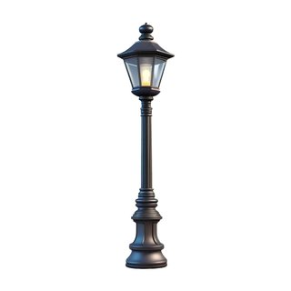</a> |  | [model.glb](025/model.glb) |
| 026 |  | <a href="026/renders/ISO_Normal.png">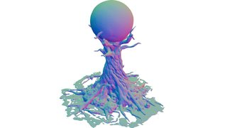</a> | [model.glb](026/model.glb) |
| 027 |  | <a href="027/renders/ISO_Normal.png">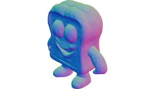</a> | [model.glb](027/model.glb) |
| 028 |  | <a href="028/renders/ISO_Normal.png">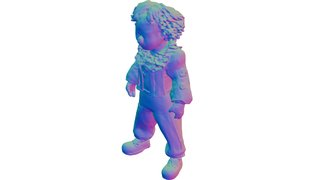</a> | [model.glb](028/model.glb) |
| 029 |  | <a href="029/renders/ISO_Normal.png">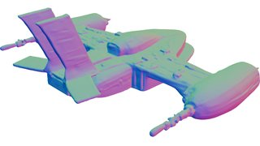</a> | [model.glb](029/model.glb) |
| 030 |  | <a href="030/renders/ISO_Normal.png">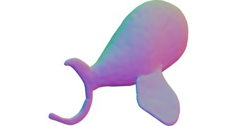</a> | [model.glb](030/model.glb) |
| 031 | <a href="031/condition.png">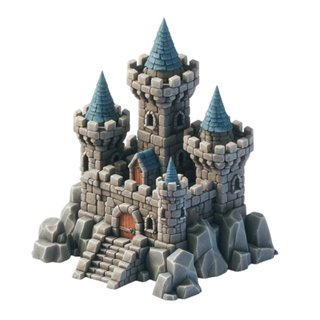</a> | <a href="031/renders/ISO_Normal.png">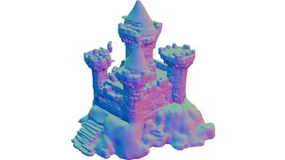</a> | [model.glb](031/model.glb) |
| 032 | <a href="032/condition.png">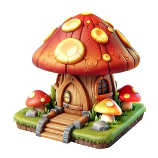</a> | <a href="032/renders/ISO_Normal.png">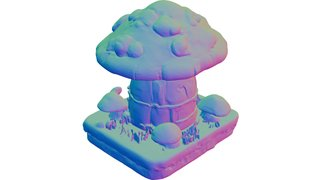</a> | [model.glb](032/model.glb) |
| 033 |  | <a href="033/renders/ISO_Normal.png">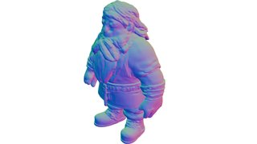</a> | [model.glb](033/model.glb) |
| 034 |  | <a href="034/renders/ISO_Normal.png">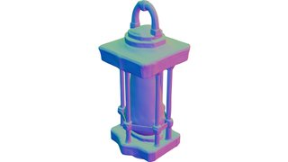</a> | [model.glb](034/model.glb) |
